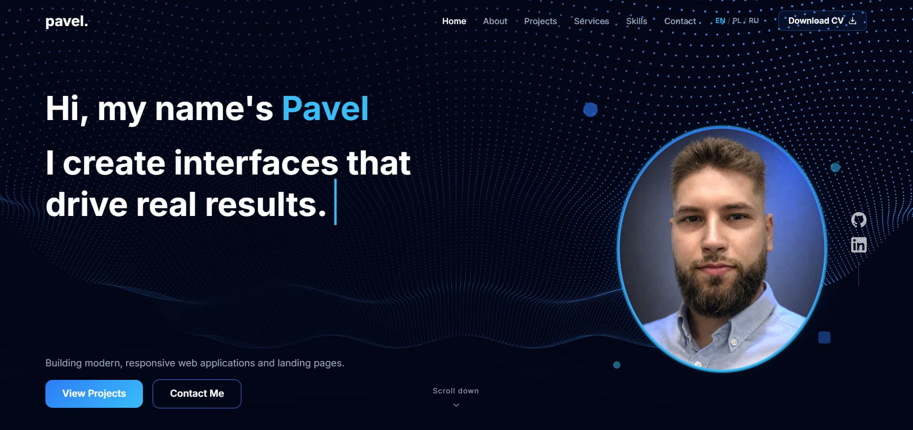

<div align="center">

# Pavel — Web Developer Portfolio

**A modern, dark-themed portfolio landing page built with React + Vite**

[](https://react.dev/)
[](https://vitejs.dev/)
[](https://www.i18next.com/)
[](https://threejs.org/)

</div>


## Features

- **Typewriter hero** — two-line animated intro that types and cycles through phrases with randomized speed. Animation runs once on page load and is never interrupted by language switches
- **3 languages (EN / PL / RU)** — full UI translation via i18next. Language is auto-detected from the browser on first visit, and saved to `localStorage` after a manual switch so it persists on reload
- **3D wave background** — live Three.js particle grid in the Hero section, animates with sine math
- **Scroll-triggered animations** — elements slide in from opposite sides the first time a section enters the viewport
- **Infinite carousel** — Services section has two rows auto-scrolling in opposite directions, fully draggable
- **Active nav tracking** — header highlights the current section automatically using `IntersectionObserver`
- **Fully responsive** — mobile burger menu, stacked layouts, touch-friendly carousel, mobile language dropdown
- **Contact form** — powered by Formspree, no backend needed
- **CV download** — PDF served directly from `public/`, downloadable via the header button


## Preview




## Sections

| Section | Description |
|---|---|
| **Hero** | Full-screen intro with typewriter animation and 3D particle wave |
| **About** | Bio + stats cards with slide-in scroll animations |
| **Projects** | Filterable project grid — filter by tag (React, API, Landing…) with live preview modal |
| **Services** | Dual auto-scrolling carousel with drag support |
| **Process** | Step-by-step breakdown of how I work |
| **Skills** | Tech stack organized by category as chip tags |
| **Contact** | Contact form + direct links (email, GitHub, LinkedIn) |

## Tech Stack

- **React 19** + **Vite 8** — fast dev server and optimized builds
- **CSS Modules** — scoped styles per component, no global class conflicts
- **i18next** + **react-i18next** — internationalization (EN/PL/RU), language persisted via localStorage
- **@react-three/fiber** — Three.js in React for the Hero wave
- **Swiper.js** — touch carousel for the Services section
- **Formspree** — contact form submissions without a backend
- **lucide-react** — icon set used throughout


## Getting Started

```bash
# 1. Clone the repo
git clone https://github.com/ep1cvoice/portfolio-landing.git
cd portfolio-landing

# 2. Install dependencies
npm install

# 3. Start the dev server
npm run dev
```

Open [http://localhost:5173](http://localhost:5173) in your browser.

```bash
# Build for production
npm run build

# Preview the production build
npm run preview
```

---

## Customization

**Colors** — all colors, spacing, and typography are in one file: `styles/variables.css`. Edit it and everything picks it up automatically.

**Portrait photo** — replace the `background-image` in `src/sections/Hero/Hero.module.css`.

**Projects / Services** — edit the data arrays at the top of `Projects.jsx` and `Services.jsx`. No config files, just JS arrays.

**CV file** — replace `public/Pavlo_Kovalchuk_Frontend_Developer_CV.pdf` with your own PDF. The download link in the header points there automatically.

**Languages** — translations live in `utils/i18n.js` as plain JS objects (one per language). To add a new language, add a new entry to the `resources` object and the `LANGUAGES` arrays in `Header.jsx` and `Footer.jsx`.

**Russian locale mapping** — `utils/i18n.js` has a `POST_USSR` array. Browser locales in that list default to Russian on first visit. Easy to adjust.

---

## Project Structure

```
src/
├── components/
│   ├── Header/         # sticky nav, active section tracking, mobile menu + language switcher
│   ├── Footer/         # language switcher, copyright
│   ├── ProjectCard/    # card used in Projects
│   └── ServiceCard/    # card used in Services
├── sections/
│   ├── Hero/           # typewriter + Three.js wave canvas
│   ├── About/          # bio + animated stats cards
│   ├── Projects/       # filterable project grid + preview modal
│   ├── Services/       # Swiper.js dual carousel
│   ├── Process/        # workflow steps
│   ├── Skills/         # chip-tag skill categories
│   └── Contact/        # Formspree form + contact links
├── pages/
│   └── HomePage.jsx    # composes all sections
styles/
├── variables.css       # edit this to retheme everything
├── globals.css
├── normalize.css
└── fonts.css
utils/
└── i18n.js             # all translations + language detection logic
public/
└── Pavlo_Kovalchuk_Frontend_Developer_CV.pdf
```

---

## License

This project is **not open source**. The code is publicly visible for portfolio purposes only — please don't copy or reuse it as your own.

---

<div align="center">
  Made by <a href="https://github.com/ep1cvoice">Pavel</a>
</div>
