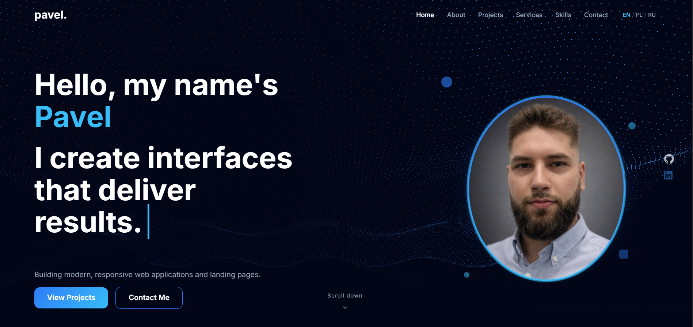

<div align="center">

# 🌐 Pavel — Web Developer Portfolio

**A modern, dark-themed portfolio landing page built with React + Vite**

[](https://react.dev/)
[](https://vitejs.dev/)
[](https://threejs.org/)
[](https://swiperjs.com/)


</div>

---

## ✨ Features

- **Typewriter hero** — two-line animated intro that types and deletes phrases with randomized speed for a human feel
- **3D wave background** — live Three.js particle grid rendered in the browser, reacts to time with sine math
- **Scroll-triggered animations** — elements slide in from opposite sides the first time a section enters the viewport
- **Infinite carousel** — Services section has two rows auto-scrolling in opposite directions, fully draggable
- **Active nav tracking** — header highlights the current section automatically using `IntersectionObserver`
- **Fully responsive** — mobile burger menu, stacked layouts, touch-friendly carousel
- **Single CSS variable file** — entire color theme lives in one place, easy to customize

---

## 🖥️ Preview



---

## 🗂️ Sections

| Section | Description |
|---|---|
| **Hero** | Full-screen intro with typewriter animation and animated 3D particle wave |
| **About** | Bio + stats cards with slide-in scroll animations |
| **Projects** | Filterable project grid — filter by tag (React, API, Landing…) |
| **Services** | Dual auto-scrolling carousel with drag support |
| **Skills** | Tech stack organized by category as chip tags |
| **Contact** | Contact form + direct links (email, GitHub, LinkedIn) |

---

## 🛠️ Tech Stack

- **React 19** + **Vite 8** — fast dev server and optimized builds
- **CSS Modules** — scoped styles per component, no global class conflicts
- **@react-three/fiber** — Three.js declaratively in React for the Hero wave
- **Swiper.js** — production-grade touch carousel for the Services section
- **lucide-react** — clean consistent icon set throughout

---

## 🚀 Getting Started

```bash
# 1. Clone the repo
git clone https://github.com/your-username/portfolio-landing.git
cd portfolio-landing

# 2. Install dependencies
npm install

# 3. Start the dev server
npm run dev
```

Open [http://localhost:5173](http://localhost:5173) in your browser.

```bash
# Build for production
npm run build

# Preview the production build
npm run preview
```

---

## 🎨 Customization

All colors, spacing, and typography are defined in a single file — `styles/variables.css`:

```css
--accent-blue:  #2D7CF6;   /* primary accent */
--accent-cyan:  #38BDF8;   /* secondary accent */
--bg-dark:      #0A0E1A;   /* darkest background */
--bg-section:   #0F1424;   /* section backgrounds */
```

To change the color scheme, edit this file — everything else picks it up automatically.

**To swap the portrait photo** — replace the `background-image` reference in `src/components/Hero/Hero.module.css`.

**To update projects / services** — edit the data arrays at the top of the respective component files (`Projects.jsx`, `Services.jsx`). No config files, just JS arrays.

---

## 📁 Project Structure

```
src/
├── components/
│   ├── Header/       # sticky nav, active section tracking, mobile menu
│   ├── Hero/         # typewriter + Three.js wave canvas
│   ├── About/        # bio + animated stats cards
│   ├── Projects/     # filterable project grid
│   ├── Services/     # Swiper.js dual carousel
│   ├── Skills/       # chip-tag skill categories
│   ├── Contact/      # form + contact link cards
│   ├── ProjectCard/  # card used in Projects
│   └── ServiceCard/  # card used in Services
├── pages/
│   └── HomePage.jsx  # composes all sections
styles/
│   ├── variables.css # 🎨 edit this to retheme everything
│   ├── globals.css
│   ├── normalize.css
│   └── fonts.css
```

---

## 📝 License

This project is **not open source**. The code is publicly visible for portfolio purposes only — please don't copy or reuse it as your own.

---

<div align="center">
  Made by <a href="https://github.com/ep1cvoice">Pavel</a>
</div>
